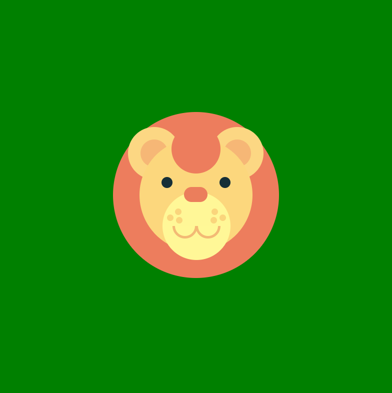

# 🦁 Leão em HTML e CSS

Projeto visual de um **leão estilizado**, criado 100% com **HTML** e **CSS puro**, sem uso de imagens, SVGs ou JavaScript. O objetivo é praticar criatividade e domínio de formas geométricas.
---

## 🎯 O que o projeto mostra

- Criação de formas (rosto, juba, olhos, focinho) com `div`s
- Estilo minimalista e divertido

---

## 🖼️ Preview

---

## 🛠️ Tecnologias

- HTML5
- CSS3

---
